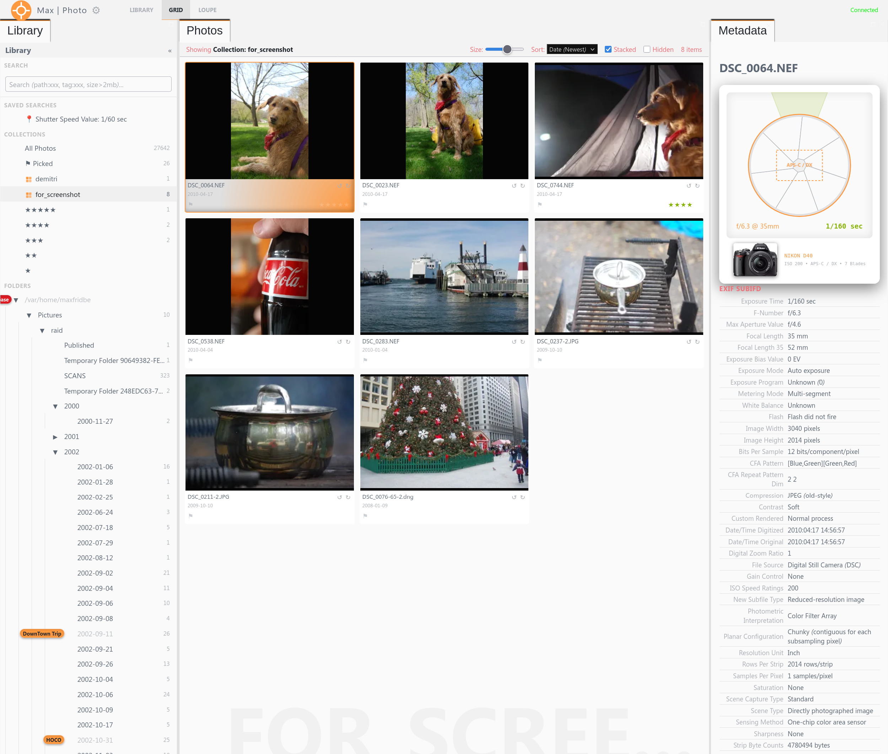
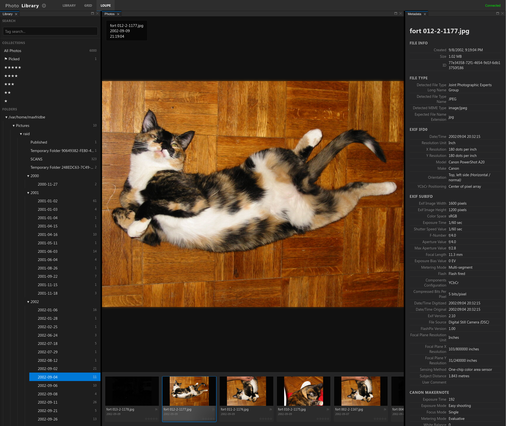
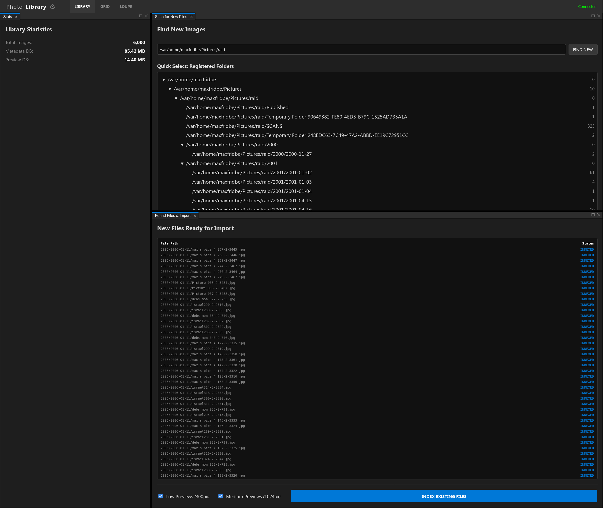
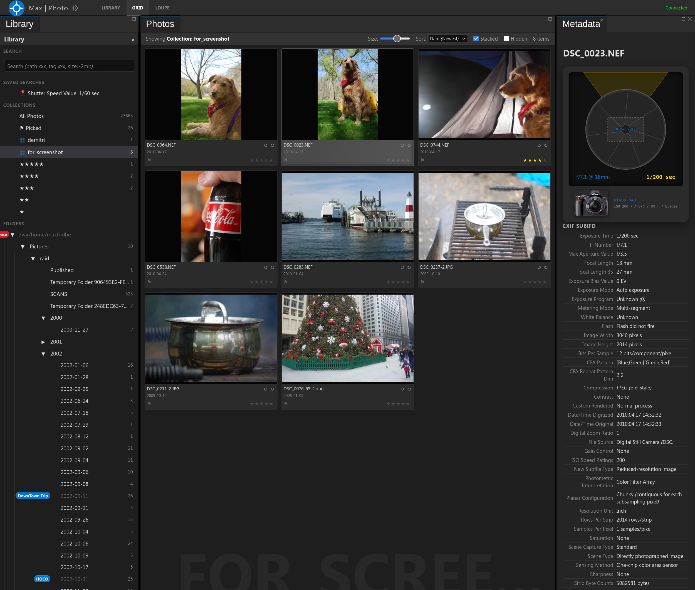

#  PhotoLibrary

A high-performance C# application designed to scan photo directories, index metadata, and host a web-based "Lightroom-style" viewer. Specifically optimized for slow network drives (CIFS/SMB) and massive libraries.






## Features

-   **Efficient Network Scanning**: Reads only the first 256KB (1MB for .cr3) of each file to extract headers/metadata, significantly improving performance on high-latency mounts.
-   **Smart Stacking (UI-Driven)**: 
    *   Automatically groups JPG + RAW (ARW/NEF/CR2/DNG/etc.) pairs with identical names in the same folder.
    *   **Prioritized Display**: RAW files are shown as the stack representative by default.
    *   **Batch Actions**: Flagging or rating a stack representative automatically applies the action to all files in the group.
    *   **Visual Indicators**: Grouped items show a layered card effect and a count badge (e.g., `(2)`).
-   **Professional Fullscreen & Loupe Viewers**:
    *   **Persistent View State**: Remembers zoom, pan, and rotation for each image, restoring it exactly when you return.
    *   **Smart Zoom**: Zooms towards the cursor position. Automatically loads full-resolution original image when zooming past 150%.
    *   **Pixel-Perfect 1:1**: "1:1" button appears when full-res is loaded to zoom to exact device pixels (retina-aware).
    *   **Rotation**: Rotate images 90° with `[` and `]`, fully synced between Loupe, Grid, and Filmstrip views.
    *   **Staged Loading**: Both viewers use staged loading (300px -> 1024px -> Full-Res) with smooth CSS transitions to provide instant feedback even on slow connections.
    *   **Persistent Caching**: Previously loaded previews and full-res renders are cached in memory for the duration of the session, making back-and-forth navigation instantaneous.
-   **Advanced Search & Discovery**:
    *   **Multi-Criteria Search**: Powerful query engine supporting path segments, metadata tag existence/values (e.g., `tag:ISO`), and numeric file size comparisons (e.g., `size > 2mb`).
    *   **Interactive Query Builder**: On-the-fly search assistance via a dynamic overlay helping construct complex queries.
    *   **Reveal in Folders**: Jump instantly from search results to the source directory while preserving your selection.
    *   **Find New Images**: Scans your directories and identifies files not yet in the database with a visual search overlay.
-   **Robust Backend & Architecture**:
    *   **WebP Optimized Previews**: All thumbnails and previews use the WebP format (Quality 80) for 30% smaller database size and faster network delivery.
    *   **Concurrent WebSocket Processing**: Backend processes image requests in parallel, preventing slow RAW conversions from blocking high-priority navigation.
    *   **Frontend Request De-duplication**: Intelligent caching of pending requests ensures only one WebSocket message is sent for the same image across multiple UI components.
    *   **Multi-Client Support**: Trackable client identifiers ensure private responses are routed correctly while maintaining global real-time library synchronization across all open tabs.
    *   **Decoupled PubSub**: Frontend uses a type-safe, constant-driven event bus for seamless communication between components.
-   **Stability & Feedback**:
    *   **Connection Tracking**: Status bar shows exact offline duration (e.g., `Disconnected (45s ago)`) during network interruptions.
    *   **Graceful Shutdown**: Responds instantly to `Ctrl+C` via integrated cancellation tokens.

## Project Structure

The project follows a decoupled architecture, separating the core backend logic from the web server and frontend.

- **PhotoLibrary/**: The main executable and web server (ASP.NET Core).
  - `wwwsrc/`: TypeScript/Snabbdom frontend source code.
  - `wwwroot/`: Compiled frontend assets and static files.
- **PhotoLibrary.Backend/**: Core domain logic and data management.
  - `DataLayer/`: SQLite database management, models, and SQL constants.
  - `ProcessingLayer/`: Image indexing, metadata extraction, preview generation, and camera database management.
- **TypeGen/**: A utility project that generates TypeScript interfaces from C# request/response models to ensure type safety across the stack.

## Usage

### Quick Start (Zero Config)
The simplest way to use PhotoLibrary is to build the self-contained executable and run it. By default, it will store all its data and configuration in `~/.config/PhotoLibrary/`.

1.  **Build**: `./build.sh`
2.  **Run**: `./dist/linux/PhotoLibrary`
3.  **Browse**: Open `http://localhost:8080` in your browser.
4.  **Import**: Use the "Maintenance" tab in the UI to add your photo directories.

### Manual Configuration
You can override any setting via CLI. These overrides are automatically saved to `~/.config/PhotoLibrary/config.json` for future runs.

```bash
# Example: Using custom database paths and port
./dist/linux/PhotoLibrary --library ~/my_photos.db --host 9090
```

### CLI Options
-   `--library <path>`: Path to the metadata SQLite database.
-   `--previewdb <path>`: Path to the previews SQLite database.
-   `--host <port>`: Port to host the web viewer on.
-   `--updatemd <dir>`: Directory to scan for images (legacy CLI-only import).
-   `--updatepreviews`: Enable preview generation during CLI scan.
-   `--longedge <pixels>`: Target size for previews (e.g., `--longedge 1024 --longedge 300`).

### Shortcuts
-   **'G'**: Grid View
-   **'L' / 'Enter' / 'Space'**: Loupe View (requires a selected image)
-   **'F'**: Toggle Fullscreen High-Res View
-   **'M'**: Toggle Metadata Panel (Right)
-   **'B'**: Toggle Library Panel (Left)
-   **'P'**: Toggle Flag (Pick) - applies to full stack if enabled
-   **'1' - '5'**: Set Star Rating - applies to full stack if enabled
-   **'0'**: Clear Star Rating
-   **'?'**: Show Shortcuts Dialog
-   **Arrows**: Navigate Grid/Filmstrip/Fullscreen

### Development Helpers
-   `./test.sh`: Samples 100 real images from RAID, preserving folder structure, and generates test DBs.
-   `./testhost.sh`: Launches the web viewer (port 8080) using test data.
-   `./run.sh`: Runs the application directly via `dotnet run`.


## Database Schema

-   **RootPaths**: Recursive folder hierarchy.
-   **FileEntry**: Core file records (Keyed by ID, includes xxHash64).
-   **Metadata**: Key-Value pairs for all photo data (Exif, XMP, etc.).
-   **images_picked / ImageRatings**: User culling data.
-   **UserCollections / CollectionFiles**: Custom user grouping logic.
-   **Previews**: Binary JPG blobs stored in a separate `previews.db` (Keyed by Hash + Size).
